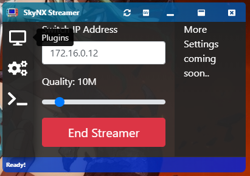

# SkyNX
A replacement for the abandoned [In-Home-Switching](https://github.com/jakibaki/In-Home-Switching/blob/master/README.md).
If you are not sure what that is, well, it is an app that allows you to stream your PC games to your Nintendo Switch! Kind of like moonlight. It is not at all entirely ready, and if there were a way to do hardware decoding on switch it would be a lot better. But for now It is definitely, definitely playable.

[Downloads are here](https://github.com/DevL0rd/SkyNX/releases).

The desktop streaming client is completely new. The Switch app however has it's roots in the original [In-Home-Switching](https://github.com/jakibaki/In-Home-Switching/blob/master/README.md) app.

## SkyNX App

## SkyNX Streamer

## Instructions:
1. Set desktop and game resolution to 1280 X 720.
2. Open SkyNXStreamer-win32-x64/SkyNXStreamer.exe
3. Launch SkyNX on switch.
4. Put the IP showed on the app into the streamer.
5. Select a streaming quality.
6. Click start streamer.

## Troubleshooting:
If for some reason the controllers don't work. Try the following steps.
1. Restart windows, and launch it again.
2. If it still is not working. And you have previously used In-Home-Switching, Try removing the ScpDriverInterface that In-Home-Switching installs. You can use the installer that came with it to uninstall it, or get it [Here](https://github.com/mogzol/ScpDriverInterface/releases/download/1.1/ScpDriverInterface_v1.1.zip).

If the streamer just starts and stops immediately, try the following steps.
1. Reinstall the xBox controller driver from the settings tab.
2. Try running it again, if it still fails, restart the system and try once more.
3. If all else fails, join us in [this thread](https://github.com/DevL0rd/SkyNX/issues/4) to pinpoint this issue.

If there is no audio playing, and you have installed the audio driver.
1. Restart windows and launch it again.
2. Remove the audio driver in settings, and reinstall it.

If your stream has high latency or is lagging. Try the following fixes and leave a issue here letting me know what fixed it.
1. Stop and start the streamer.
2. Make sure your desktop resolution is 1280 X 720
3. Make sure your game doesn't reset that resolution.
4. Restart your router and make sure it isn't being bogged down by anything.

## Known issues
  * So far Switch crashes when put to sleep with app running, please close app beforehand. It will be fixed after optimizations.
  * App breaks when Switch changes from docked to handheld mode or vice-versa. Please quit the app before doing so.

## Credits to
* [DuchessOfDark88](https://twitter.com/DuchessOfDark88) App icon and graphics. (Some content at this link may be NSFW)
* [jakibaki](https://github.com/jakibaki) For the original [In-Home-Switching](https://github.com/jakibaki/In-Home-Switching/blob/master/README.md) Switch app I am using as a base.
* [ffmpeg](https://www.ffmpeg.org/) for being such a powerful media tool that we use on PC and Switch.
* [SwitchBrew](https://switchbrew.org/) for libNX and its ffmpeg inclusion
* [Atmosphère](https://github.com/Atmosphere-NX/Atmosphere) for being such a great Switch CFW
* [Screen Capture Recorder](https://github.com/rdp/screen-capture-recorder-to-video-windows-free) for helping us grab audio.
