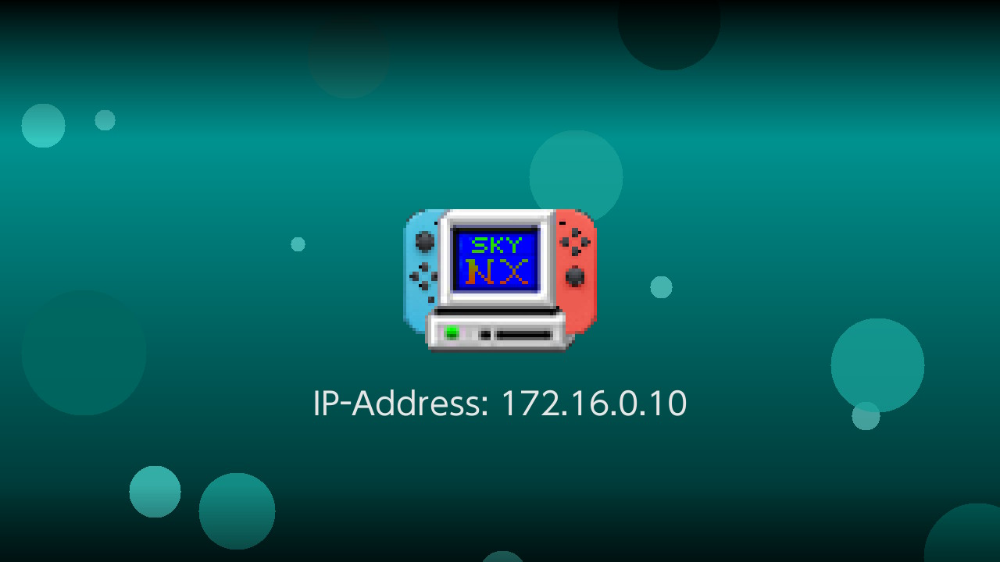
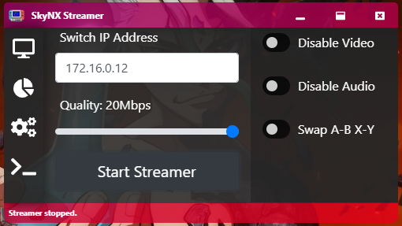
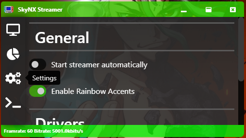

# SkyNX
Stream your PC games to your Nintendo Switch without Android! Now on the Homebrew App Store!
This is replacement for the abandoned [In-Home-Switching](https://github.com/jakibaki/In-Home-Switching/blob/master/README.md).

[Downloads are here](https://github.com/DevL0rd/SkyNX/releases).

Also, if you can help, I'm currently looking for a job. If you have any leads, let me know at SkyNxApp@gmail.com.

[Video Instructions / Review Here](https://www.youtube.com/watch?v=YtnIqVdYbf4). Big shout out to Jonny Troche for this high quality tutorial! Make sure to like and subscribe guys ;D

If your interested in using SkyNX to turn your Nintendo Switch into a WiiU gamepad using Cemu. Here is a link with my tutorial on how to set it up! [Nintendo Switch as a WiiU Gamepad](https://gbatemp.net/threads/how-to-use-your-switch-as-a-wiiu-game-pad-in-cemu-using-skynx.563405/)

As per user suggestions I have made a patreon and a paypal.
If you think this app is Useful, Plese consider donating to support its development. [Donate](https://www.paypal.me/SkyNX)

The desktop streaming client is completely new. The Switch app however has it's roots in the original [In-Home-Switching](https://github.com/jakibaki/In-Home-Switching) app.
## Features
 * Stream PC games with audio to switch at 60fps!
 * Handles up to 8 JoyCon pairs. (8 Players at once!)
 * Motion control support for Cemu.
 * Use Analog sticks and triggers to control mouse
 * Use gyro to control mouse like a Wii remote.
 * Built in Nvidia encoding for low latency.
 * Built in AMD encoding for low latency. 
 * Built in Intel encoding for low latency.
 * Automatically sets desktop resolution for max performance. (Optional)
 * Optionally disable video  to use the JoyCons as remotes on PC!
 * Optionally disable audio.
 * Optionally swap A and B AND X and Y.
 * Handles basic touch input.
 * Handles right click. (Touch with 1 finger, tap with the second)
 * Handles scrolling. (Your standard 2 finger scroll.)

## Instructions:
NOTE if you have a issue installing the audio driver, make sure you have the latest [VCRedist](https://www.microsoft.com/en-us/download/confirmation.aspx?id=5555)
1. Copy the switch folder in SkyNX.zip, to the root of your sd card.
2. Install the forwarder with a nsp installer such as Goldleaf.
3. Extract SkyNXStreamer-win32-ia32.zip to somewhere safe.
4. Open SkyNXStreamer-win32-ia32/SkyNXStreamer.exe
5. Launch SkyNX on switch.
6. Put the IP showed on the app into the streamer.
7. Click start streamer.

## SkyNX App

## SkyNX Streamer

## Troubleshooting:
If for some reason the controllers don't work. Try the following steps.
1. Restart windows, and launch it again.
2. If it still is not working. And you have previously used In-Home-Switching, Try removing the ScpDriverInterface that In-Home-Switching installs. You can use the installer that came with it to uninstall it, or get it [Here](https://github.com/mogzol/ScpDriverInterface/releases/download/1.1/ScpDriverInterface_v1.1.zip).

If the streamer just starts and stops immediately, try the following steps.
1. Reinstall the xBox controller driver from the settings tab.
2. Try running it again, if it still fails, restart the system and try once more.

If there is no audio playing..
1. Remove the audio driver in settings, and re-install it. If it doesn't work then try step 2.
2. Restart windows and launch it again.

## Known issues
  * So far Switch crashes when put to sleep with app running, please close app beforehand. It will be fixed after optimizations.
  * App breaks when Switch changes from docked to handheld mode or vice-versa. Please quit the app before doing so.

## Credits to
* [DuchessOfDark88](https://twitter.com/DuchessOfDark88) App icon and graphics. (Some content at this link may be NSFW)
* [jakibaki](https://github.com/jakibaki) For the original [In-Home-Switching](https://github.com/jakibaki/In-Home-Switching/blob/master/README.md) Switch app I am using as a base.
* [ffmpeg](https://www.ffmpeg.org/) for being such a powerful media tool that we use on PC and Switch.
* [SwitchBrew](https://switchbrew.org/) for libNX and its ffmpeg inclusion
* [Atmosphère](https://github.com/Atmosphere-NX/Atmosphere) for being such a great Switch CFW
* [Screen Capture Recorder](https://github.com/rdp/screen-capture-recorder-to-video-windows-free) for helping us grab audio.
